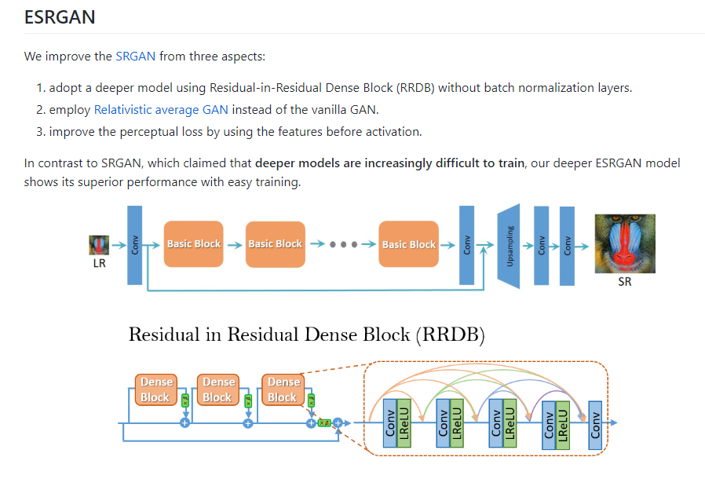
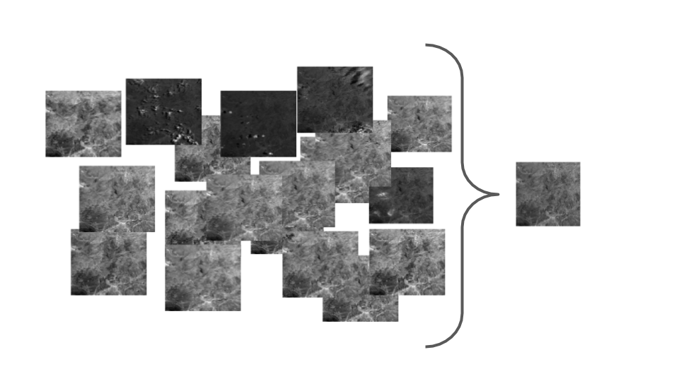
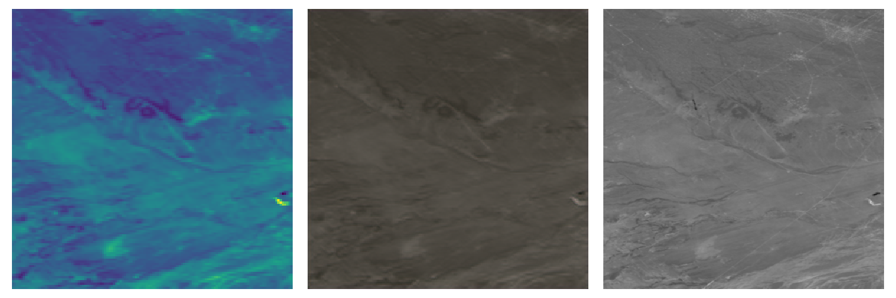
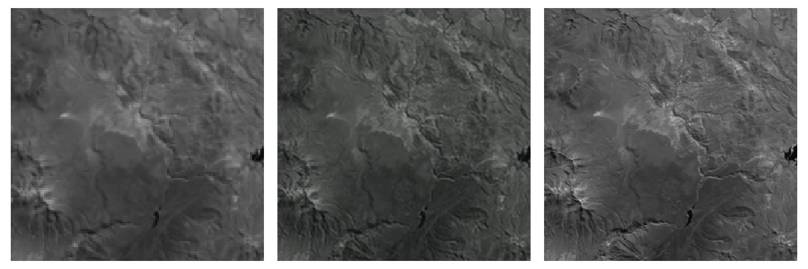
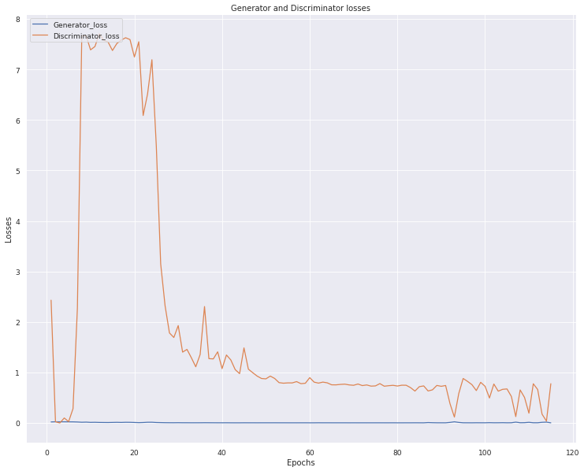
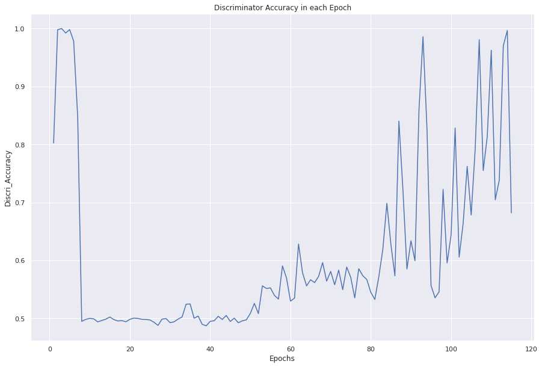
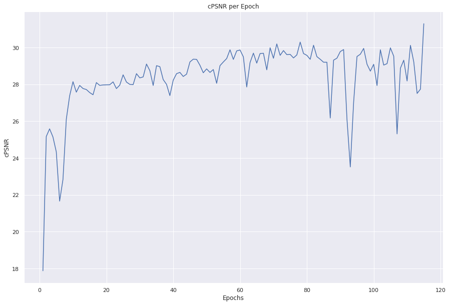

# ESRGAN_Proba-V
Tackling Proba-V competition with a modified version of ESRGAN.

## About Proba-V
Proba-V is a miniaturized ESA satellite tasked with a full-scale mission: to map land cover and vegetation growth across the entire earth every two days. It is the latest in ESA’s Proba series of minisatellites, among the smallest satellites launched by the agency. 
It operates on a sun-synchronous near polar Earth orbit at about 820Km guaranteeing the required swath of 2250Km with an instrument field of view of 102 degrees, compatible with the geographical coverage. 
The Proba-V satellite carries a new Vegetation instrument, as single operational payload. 
In the frame of the In-Orbit Demonstration, the Proba-V platform also flies 5 technological payloads:
* X-Band transmitter based on GaN RF amplifier,
* Energetic Particle Telescope EPT,
* Automatic Dependent Surveillance Broadcast (ADS-B) receiver,
* SATRAM radiation monitoring system, complementing EPT,
* HERMOD (fiber optic connectivity in-situ testing).

The Proba-V mission provides multispectral images to study the evolution of the vegetation cover on a daily and global basis. 
The ‘V’ stands for Vegetation, and the mission is extending the data set of the long-established Vegetation instrument, flown as a secondary payload aboard France’s SPOT-4 and SPOT-5 satellites launched in 1998 and 2002 respectively. 
The Proba-V mission has been developed in the frame of the ESA General Support Technology Program GSTP and the contributors to the Proba-V mission are Belgium and Luxembourg. 
For more details: https://www.esa.int/Applications/Observing_the_Earth/Proba-V

## Proba-V Super Resolution Competition
Proba-V Super Resolution Competition has been launched on the 1st of November 2018 with a timeline of 8 months to get an end at the 1st of June 2019.  
In this competition multiple images are given of each of the 74 Earth locations and challengers were asked to develop an algorithm to fuse them together into a single image.  
The result will be a “Super-Resolved” image that is checked against a “High Resolution” image taken from the same satellite PROBA-V.  
The main goal of this competition is to construct such high-resolution images by fusion of the more frequent 300m images. 
This process, which is known as Multi-image Super Resolution has already been applied to satellite before.  
The images provided for this challenge are not artificially degraded, but are real images recorded from the very same scene, just at different resolutions and different times. Any improvements on this data-set might be transferable to larger collections of remote sensing data without the need to deploy more expensive sensors or satellites, as resolution enhancement can happen post-acquisition. 
So, the goal is the enhancement of the vision PROBA-V and helping researchers advance the accuracy on monitoring earths vegetation growth. 
For more details: https://kelvins.esa.int/proba-v-super-resolution/home/

## DATASET
The Data is composed of radiometrically and geometrically corrected TOA (Top of Atmosphere) reflectance’s for the RED and NIR spectral bands at *300m* and *100m* resolution. 
The *300m* resolution data delivered as *128x128* grey-scale pixel images, the *100m* resolution data as *384x384* grey-scale pixel images. 
The bit-depth of the images is 14, but the are saved in 16-bit .png format. 
The dataset contains 1450 scenes, which are split into 1160 scenes for training and 290 for testing. 
Each scene contains at least 9 low resolution images and max of 34 images (LR*), their respective status map (QM*) and one high resolution (HR*) and its respective status map (SM*). 
Once you unzip the probav_data.zip you will get the following path: 
* Proba-V / test / NIR / scenes / LR + QM
* Proba-V / test / RED / scenes / LR + QM
* Proba-V / train / NIR / scenes / LR + QM + HR + SM
* Proba-V / train / RED / scenes / LR + QM + HR + SM
* Proba-V / norm.csv

## My own Approach
I will detail my reasoning and finding when attempting the Proba-V super resolution competition. (competition is already over).
This project was made in 2 steps:
1. Preparing the data: Images preprocessing
2. Training the model and then deploying it (Test)
After looking on previous works that been done on Proba-V super resolution competition and while attempting to make a new approach I decide to use a modified version of ESRGAN (Enhanced Super Resolution Gan) which is already a modified version of SRGAN in order to tackle the problem. 
Details can be found in these two links: 
* [SRGAN](https://arxiv.org/pdf/1609.04802.pdf)
* [ESRGAN](https://arxiv.org/pdf/1809.00219.pdf)

  

While creating ESRGAN model, I skipped the 2nd aspect: which is the use of RAGAN. 
Next version of the project will contain RAGAN.

## Preparing the Data: (Preprocessing.ipynb)
In order to have one candidate image using multiple low resolution (LR) images, some preprocessing steps were necessary. 

  

Some images in the dataset are partially obstructed (Clouds, Ice…) and up to *25%* of pixels can be concealed (*40%* for low resolution images) thus, increasing the need of using multiple low-resolution images. 
The images are a representation of two spectral bands (RED and NIR).  
The images are stored in a uint16 bit format as PNGs and are supposed to be of 14bit-depth. 
So, my initial pipeline process was the following:
#### For Low Resolution (Train & Test):
1. Loading the images as uint16
2. Using the norm.csv to normalize cPSNR
3. Parsing the dataset and checking for high pixels in order to remove them, since the images are stored in a uint16.
4. Decomposing the status map (QM) into 8 patches and searching for the best score among all QMs to generate candidate patches that will be used to construct the candidate image (Respective LR patches to QM patches).
5. Saving the created candidate LR as float64 image and shifting it to 14bits.
6. Creating an RGB representation of a grey-level image using the gray2rgb function.
7. Saving LRs as np.array

**PS**: Since I’m low on memory I processed each band on it own and then I combine them into a single np.array ‘LR_train.npy’ and ‘LR_test.npy’
#### For High Resolution (Only Train):
1. Loading HR images as uint16
2. Shifting them by two to 14bits
3. Creating an RGB representation of a grey-level image using the gray2rgb function.
4. Saving HRs as np.array 

**PS**: Since I’m low on memory I processed each band on its own and then I combine them into a single np.array ‘HR_train.npy’.

You may ask why converting both HR and LR from gray2rgb, well the only one that need to be really converted is HR and that’s because VGG19 that’s used as feature extractor requires as input shape *(224,224 ,**3**)* and it should have an input of EXACTLY *3* channels, and width and height should be no smaller than *32*.

## The ESRGAN model used: (ESrganModel.py)
In this file, I have created ESRGAN model, where I initiated my input and output shapes: ‘LR’ shape is *(128,128,3)* and ‘HR’ shape is *(384,384,3)*. 
I have built ESRGAN model that process input (LR image) through a Generator and a feature extractor (VGG19) to create (SR images) that will be judged as good or not by the Discriminator. 
The Generator is adopting a deeper model using RRDB (Residual-in-Residual Dense Block) without batch normalization layers followed by an Upsampling-block with a scale factor equal to *3* in order to create images *(128x3,128x3,3)*. 
The Discriminator is the same as vanilla GAN discriminator: his purpose is to distinguish SR from HR. 

### Losses:
The competition scores Super Resolution SRs using a modified PSNR (Peak Signal Noise Ratio) that consider which pixel was concealed or not in the High-Resolution image HR. 
PSNR is a measure of the distortion of the image based on the MSE (Mean Square Error) between the reconstructed image and the original image. 
For this competition PSNR is modified to cPSNR (Clear Peak Signal Noise Ratio) and instead of using MSE I used the cMSE (Clear Mean Square Error) which compute the MSE only for unconcealed pixels and consider the brightness bias.

## Training: (python3 run.py train)
This phase was a little bit restricted by the resources, since I’m running and testing my scripts on Google Colab. (Got banned for a while for successive use)  
My goal was to train the model for *1000+* epochs but due to the low resources I just made it to 100+epochs. 
Comments will guide you through my code and you can start train from 0 (just comment line 90) or load from a given weights (keep the line 90 uncommented). 
Through training process, in every iteration, I’m saving cPSNR value, Generator and Discriminator losses.

*(Attention!!!)* 
Python is accumulating memory so I’m clearing out the dictionaries where I’m saving cPSNR, Gen & Disc losses and it cause Colab memory to explode even while using the *25Go* RAM option. 
That’s why I have used batch_size equal to 4 and not 2 to reduce the number of variables that I’m generating every iteration (290 iterations instead of 580).

*(Temporary Solution!!!)* 
* You can reduce the number of epochs to 3 and then load them and start over and over.
* You can uncomment the lines that are related to creating and storing the cPSNR and Gen & Disc losses if you just trying to visualize and see how this project works.
* Just get access to a better platform than Colab .

To visualize how the model is doing, I’ have created a visualization function that will guide me through the training process by plotting images that contains (Low Resolution (**left**), Super Resolution (**middle**), High Resolution (**right**)).

I wanted to compute the cPSNR value and to do so I will have to make both SR and HR same type, so I decided to just change HR type to float32 just after loading the ‘LR_train.npy’ and ‘HR_train.npy’.

## Testing: (python3 run.py test)
After every epoch, my script will generate a generator model.h5, put that model in ./models folder and it will be loaded with the ‘LR_test.npy’ and that will test your model and save the SR images generated from LR_test in the ./predictions folder.
In this phase we don’t provide our model HRs images so basically it will create SRs *(384,384,3)* images from LRs *(128,128,3)*

## Discussion and Results: 
I have tried my different things during this project, starting from generating a SR image *(384,384,**3**)* from LR image *(128,128,**1**)*.
Example when LR image shape is *(128,128,**1**)*, SR and HR images shape is *(384,384,**3**)*:

  

The results were decent and that’s why I have tried to change even the LRs images using grey2rgb function so I can see if there are some improvements in the quality of enhancement. 
What I have conclude during these tests, is the fact that the generator is getting better and better while using LRs with shape *(128,128,**3**)* quicker than when using LRs with shape *(128,128,**1**)*. 
Example when LR image shape is *(128,128,**3**)*, SR and HR images shape is *(384,384,**3**)*:

  

In the ./results folder I have added some samples of the SR images that I have saved during training phase and also I added images from the test phase. 
I also put the plots representing (Generator and Discriminator losses, Discriminator Accuracy, Content loss and finally cPSNR).

  

  

The images, generated during the training phase, explain these two graphs. 
At the beginning of the training, the discriminator is getting a good accuracy, which is normal since my generator is still learning, but later on the discriminator accuracy is getting lower and lower and it can be explained by the improvement of the SR generated images. 
At some point, my generator is getting new ways to improve the quality of SR, and that’s why the accuracy of the discriminator spikes from time to time. 

  

This figure shows the mean value of cPSNR during the training phase for each epoch. The cPSNR is getting better and better over the epochs starting from 17 to reach 31 at epoch 115.

You can download the images generated during training [link](https://drive.google.com/open?id=1z9VH2bwPwePWs8I2zntB5eME2lv3HhKI). 
You can also download the generated SR images from test folder (model-epoch-111) [link](https://drive.google.com/open?id=1_i_nBJjed6A0-z9w6pfdVcPRIZ1TjEgX).

To launch this project: 
1. execute *preprocessing.ipynb*
2. *python3 run.py train*
3. *python3 run.py test*

## Future Work :
1. Employ relativistic average GAN (RAGAN) instead of the vanilla GAN.
2. Create a new training set using the ESRGAN model (generate SRs from LRs to enhance the image quality), then I will use the SRs and respective HRs to train a new SRGAN model.
